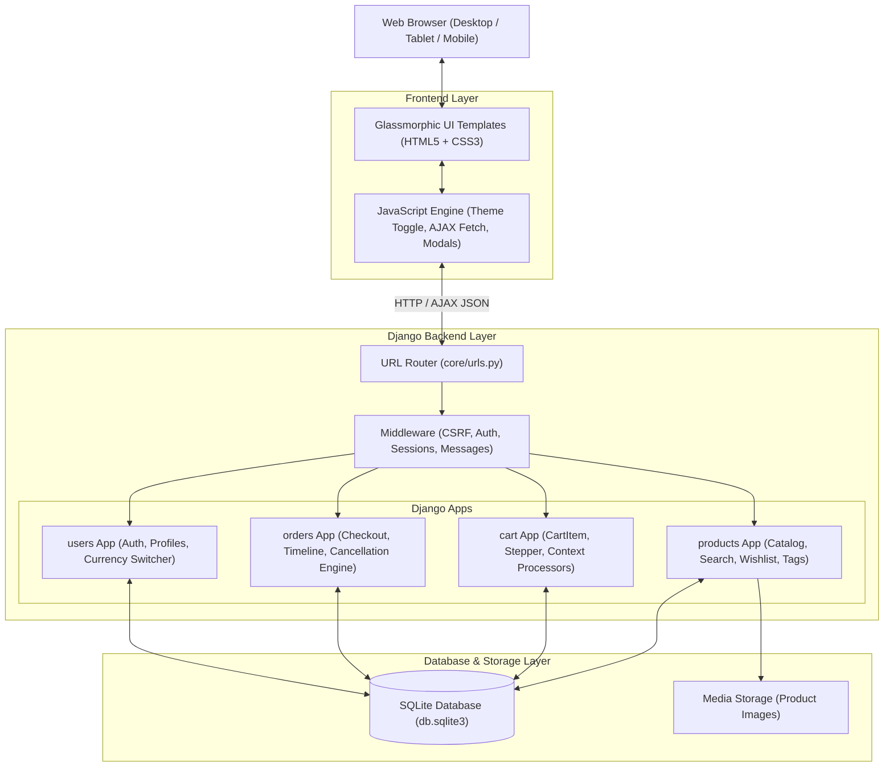

# ShopNest Pro — Modern Full-Stack Django E-Commerce Platform

> **A feature-rich, high-performance e-commerce platform crafted with Django, modern glassmorphic UI architecture, pure Decimal-safe financial arithmetic, and complete order lifecycle management.**

---

## 📌 Overview

**ShopNest Pro** is a full-stack web application designed to simulate real-world modern digital commerce platforms like Amazon and Flipkart. Built using **Django** and a custom **Glassmorphic UI Design System** (Vanilla CSS3 + Bootstrap 5), it delivers a seamless end-to-end shopping experience—from product discovery and multi-parameter filtering to persistent carts, multi-step demo checkout, simulated payments, live shipment timeline tracking, and safe inventory-restoring order cancellations.

### The Problem It Solves
Traditional student e-commerce projects often suffer from:
1. **Financial Arithmetic Errors**: Inaccurate float math causing rounding discrepancies in discounts, taxes, and multi-currency conversions.
2. **Broken Order Lifecycle**: Inability to safely cancel early-stage orders and automatically restore stock inventory to the database.
3. **Cluttered/Generic UI**: Dated interfaces with no dark/light mode engine, poor visual hierarchy, or missing responsive spacing.
4. **Non-Persistent Carts**: Session-only carts that vanish upon logging in from different devices.

### The Solution
ShopNest Pro solves these challenges through:
- **Pure `Decimal` Financial Engine**: Zero float operations in price calculations, multi-currency conversions (INR ₹ & USD $), and itemized discount breakdowns.
- **Atomic Order Management**: Database transactions (`transaction.atomic()`) that safely handle order placement, stock deduction, cancellation eligibility checks, and automatic inventory restoration.
- **Ultra-Vibrant Dual-Theme Glassmorphism**: Tailored frosted-glass components (`backdrop-filter: blur(28px)`), luminous borders, dark/light theme toggle, and responsive layouts across all viewports.
- **Database-Backed Cart & Wishlist**: User-bound models with instant AJAX operations and badge micro-animations.

---

## 🌟 Key Features

### 1. 🛍️ Product Catalog & Discovery
- **Extensive Catalog**: 63+ curated products across 12 distinct categories (`Electronics`, `Gaming`, `Fashion`, `Home & Kitchen`, `Sports & Fitness`, `Books`, `Accessories`, `Beauty & Personal Care`, `Toys & Games`, `Automotive & Tools`, `Gourmet & Grocery`, `Office & Stationery`).
- **Dynamic Multi-Parameter Filtering**: Filter simultaneously by Category, Brand, Minimum/Maximum Price Range, and In-Stock availability.
- **Rich Multi-Option Sorting**: Sort by `Featured`, `Price: Low to High`, `Price: High to Low`, `Customer Rating`, `Highest Discount`, and `Newest First`.
- **Search Engine**: Real-time multi-field search scanning product titles, brands, categories, and descriptions via Django `Q` objects.
- **Deals of the Day**: Dedicated flash sales section highlighting items with discounts $\ge 15\%$.

### 2. 💰 Transparent Pricing & Currency Engine
- **Itemized Discount Breakdown**: Every product card, cart item, and checkout summary clearly displays:
  - Original List Price / MRP (struck-through)
  - Promotional Sale Price
  - Percentage Discount Badge (e.g., `-18% OFF`)
  - Direct Savings Indicator (e.g., `Save ₹1,449.90`)
- **Global Currency Switcher**: Instant session-based currency conversion between Indian Rupee (INR ₹) and US Dollar (USD $) using strict `Decimal` scaling factors.
- **Custom Currency Template Tags**: Pure Decimal formatting with standard comma thousand-separators (`₹94,999.00` / `$1,144.57`).

### 3. 🛒 Cart & Wishlist Ecosystem
- **Persistent Database Cart**: `CartItem` model linked to registered users, preserving cart contents across devices and sessions.
- **AJAX Stepper Controls**: Real-time quantity increment, decrement, and item removal without full-page reloads.
- **Interactive Wishlist**: AJAX-powered heart toggle buttons on product cards and detail pages, with a dedicated Wishlist management hub.
- **Global Context Processor**: Injects live `cart_count`, `cart_total`, `cart_original_total`, `cart_savings`, and `wishlist_count` into all templates.

### 4. 💳 Multi-Step Checkout & Simulated Payments
- **5-Stage Visual Stepper**: Clear visual progress (`1. Cart` $\rightarrow$ `2. Address` $\rightarrow$ `3. Delivery` $\rightarrow$ `4. Payment` $\rightarrow$ `5. Confirm`).
- **Simulated Payment Gateway**: Interactive selection for:
  - Credit / Debit Card (Instant demo authorization)
  - Instant UPI / QR (Simulated QR payment)
  - Net Banking (Simulated bank gateway)
  - Cash on Delivery (Demo COD)
- **Demo Reference / Transaction ID**: Automatically generates unique transaction identifiers (e.g., `SN-AEE947E3`) saved directly on the order record.

### 5. 📦 Order Management, Tracking & Safe Cancellation
- **Live Lifecycle Timeline**: Visual 6-step progression stepper on Order Details:
  $$\text{Order Placed} \longrightarrow \text{Confirmed} \longrightarrow \text{Processing} \longrightarrow \text{Shipped} \longrightarrow \text{Out for Delivery} \longrightarrow \text{Delivered}$$
- **Safe Order Cancellation**:
  - **Eligibility Guard**: Customers can cancel orders only during early stages (`pending`, `confirmed`, `processing`).
  - **Confirmation Modal**: Prevents accidental cancellations by requiring explicit confirmation.
  - **Automatic Inventory Stock Restoration**: All purchased item quantities are immediately restored to `Product.stock` upon cancellation.
  - **Double-Cancellation Protection**: Guards against duplicate stock restoration attempts.
  - **Simulated Refund / Void**: Payment status is updated to `cancelled / void`, and the order record is preserved in history.

### 6. 🔐 Authentication & Profile Dashboard
- **Unified Authentication Layout**: Dedicated viewport-safe login and registration pages that guarantee zero clipping under fixed navbars.
- **Auto-Login on Registration**: Automatically authenticates users immediately upon account creation.
- **User Dashboard**: Live profile analytics displaying total orders placed, wishlist count, and active cart items, alongside recent purchase history.
- **Profile Management**: Profile editing form for updating personal details and email address.

---

## 🛠️ Technologies Used

| Technology / Library | Version | Purpose in ShopNest Pro |
|---|---|---|
| **Python** | 3.11+ | Backend language for application logic, models, and controllers |
| **Django** | 5.2+ | Full-stack web framework (MVC/MVT pattern, ORM, Auth, Sessions) |
| **SQLite3** | 3.x (Built-in) | Relational database storing users, products, carts, orders, and wishlist |
| **Pillow** | 10.0+ | Image processing library for Django `ImageField` handling |
| **HTML5 & Vanilla CSS3** | Modern Standards | Semantic structure and custom Glassmorphic design tokens |
| **Bootstrap** | 5.3.3 | Responsive grid system, modal dialogs, and dropdown utilities |
| **Bootstrap Icons** | 1.11.3 | Vector iconography across navbar, status badges, forms, and cards |
| **JavaScript (ES6+)** | Native | DOM manipulation, Theme engine (Dark/Light), AJAX requests (Fetch API) |

---

## 📐 System Architecture

ShopNest Pro follows Django's Model-View-Template (**MVT**) architecture, enhanced with asynchronous AJAX endpoints for a dynamic Single-Page-App (SPA) feel.



---

## 📂 Project Directory Structure

```text
ecommerce/
├── cart/                               # Shopping Cart Application
│   ├── migrations/                     # Database migration files
│   ├── admin.py                        # CartItem admin registration
│   ├── apps.py                         # App configuration
│   ├── context_processors.py           # Global cart, wishlist & currency context
│   ├── models.py                       # CartItem database model
│   ├── urls.py                         # Cart URL routes (add, remove, update)
│   └── views.py                        # Cart business logic & AJAX handlers
├── core/                               # Project Root Configuration
│   ├── asgi.py                         # ASGI entry point
│   ├── settings.py                     # Main settings (Apps, Middleware, DB, Auth)
│   ├── urls.py                         # Master URL routing linking all apps
│   └── wsgi.py                         # WSGI entry point
├── orders/                             # Orders & Checkout Application
│   ├── migrations/                     # Database migrations
│   ├── admin.py                        # Order & OrderItem admin interfaces
│   ├── apps.py                         # App configuration
│   ├── forms.py                        # Checkout shipping & payment form
│   ├── models.py                       # Order & OrderItem models + Cancellation logic
│   ├── urls.py                         # Order routes (checkout, detail, cancel, history)
│   └── views.py                        # Checkout processing, timeline & cancellation
├── products/                           # Catalog & Wishlist Application
│   ├── management/
│   │   └── commands/
│   │       └── seed_products.py        # 63-item database catalog seeder
│   ├── migrations/                     # Database migrations
│   ├── templatetags/
│   │   └── currency_tags.py            # Custom  template tag
│   ├── admin.py                        # Product & Wishlist admin customization
│   ├── apps.py                         # App configuration
│   ├── models.py                       # Product & Wishlist database models
│   ├── urls.py                         # Catalog routes (home, detail, search, wishlist)
│   └── views.py                        # Filtering, sorting, searching & wishlist views
├── static/                             # Static Assets
│   ├── css/
│   │   └── style.css                   # Custom Glassmorphic Design System (1500+ lines)
│   └── js/
│       └── main.js                     # Theme engine, AJAX add-to-cart, wishlist & modals
├── templates/                          # Django HTML Templates
│   ├── base.html                       # Base layout (Navbar, Footer, Toasts, Theme Engine)
│   ├── cart/
│   │   └── cart.html                   # Cart page with price breakdown & steppers
│   ├── orders/
│   │   ├── checkout.html               # 5-step checkout & payment selector
│   │   ├── confirmation.html           # Order receipt with demo transaction ID
│   │   ├── detail.html                 # Order detail with live tracking & cancellation
│   │   └── history.html                # My Orders history table with status pills
│   ├── products/
│   │   ├── _product_card.html          # Reusable glassmorphic product card component
│   │   ├── home.html                   # Hero, Category Explorer, Deals & Catalog
│   │   ├── product_detail.html         # Showcase, specs, stock status & related items
│   │   ├── search.html                 # Search results with sorting & query feedback
│   │   └── wishlist.html               # Wishlist grid with responsive empty state
│   └── users/
│       ├── edit_profile.html           # Profile editing form
│       ├── login.html                  # Viewport-safe glassmorphic login card
│       ├── profile.html                # User dashboard with live stats & recent orders
│       └── register.html               # Viewport-safe registration card
├── users/                              # User Management Application
│   ├── migrations/                     # Database migrations
│   ├── admin.py                        # User admin configurations
│   ├── apps.py                         # App configuration
│   ├── forms.py                        # UserRegisterForm & UserProfileForm
│   ├── urls.py                         # Auth routes (login, register, logout, profile)
│   └── views.py                        # Authentication views & currency toggle
├── db.sqlite3                          # SQLite database file
├── manage.py                           # Django CLI management utility
└── requirements.txt                    # Project dependencies
```

---

## ⚙️ How the Project Works (Step-by-Step)

```text
1. User Accesses Platform
   └── Homepage loads catalog with 12 categories, flash deals, and sort/filter toolbar.

2. User Browses & Filters Products
   └── Selects category/price/brand -> Django views filter SQLite database using Decimal queries.

3. User Interacts with Cart / Wishlist
   └── AJAX request sent to `/cart/add/<id>/` or `/wishlist/toggle/<id>/`.
   └── Server updates CartItem/Wishlist model and returns JSON.
   └── Navbar badge updates smoothly with pop micro-animation.

4. User Navigates to Checkout
   └── User fills recipient details and selects simulated payment method (Card/UPI/NetBanking/COD).
   └── Decimal engine computes MRP total, itemized discounts, and final payable amount.

5. Order Creation (Atomic Transaction)
   └── Order and OrderItem records created with price snapshots and demo Transaction ID.
   └── Product inventory stock is safely decremented. Cart is cleared.

6. Order Tracking & Lifecycle Management
   └── User views order details with visual 6-stage lifecycle progression timeline.
   └── If order is in early stage (Pending/Confirmed/Processing), user can click "Cancel Order".
   └── Cancellation modal confirms action -> Order status changed to Cancelled -> Item quantities
       are automatically returned to inventory stock -> Demo authorization voided.
```

---

## 🚀 Quick Start & Installation

### Prerequisites
- **Python 3.10+** (Tested on Python 3.11)
- **pip** (Python package installer)
- **Git** (Optional, for cloning)

### Step 1: Clone or Download the Repository
```bash
git clone https://github.com/your-username/shopnest-ecommerce.git
cd shopnest-ecommerce
```
*(Or extract the downloaded ZIP and open the `ecommerce` folder in your terminal).*

### Step 2: Create and Activate a Virtual Environment
```bash
# Windows (PowerShell / Command Prompt)
python -m venv venv
venv\Scripts\activate

# macOS / Linux
python3 -m venv venv
source venv/bin/activate
```

### Step 3: Install Dependencies
```bash
pip install -r requirements.txt
```

### Step 4: Configure Environment Variables
Copy the example environment file and configure your local settings:
```bash
# Windows (PowerShell / Command Prompt)
copy .env.example .env

# macOS / Linux
cp .env.example .env
```

### Step 5: Run Database Migrations
```bash
python manage.py migrate
```

### Step 6: (Optional) Seed 63+ Sample Products
```bash
python manage.py seed_products
```

### Step 7: Create an Admin Superuser (Optional)
```bash
python manage.py createsuperuser
```

### Step 8: Start the Development Server
```bash
python manage.py runserver 127.0.0.1:8000
```

Open your web browser and navigate to: **`http://127.0.0.1:8000`**

---

## 📡 API & AJAX Endpoints

ShopNest Pro uses clean RESTful AJAX endpoints for interactive operations:

### 1. Toggle Wishlist
- **Method**: `GET`
- **URL**: `/wishlist/toggle/<int:pk>/`
- **Headers**: `X-Requested-With: XMLHttpRequest`
- **Response**:
  ```json
  {
    "status": "success",
    "action": "added",
    "message": "Added \"Sony WH-1000XM5\" to your Wishlist.",
    "wishlist_count": 3,
    "product_id": 1
  }
  ```

### 2. Add to Cart (AJAX)
- **Method**: `POST`
- **URL**: `/cart/add/<int:product_id>/`
- **Headers**: `X-Requested-With: XMLHttpRequest`, `X-CSRFToken: <token>`
- **Response**:
  ```json
  {
    "status": "success",
    "message": "Added \"Apple iPad Air 11\"\" to your cart.",
    "cart_count": 2
  }
  ```

### 3. Cancel Order
- **Method**: `POST` / `GET`
- **URL**: `/orders/cancel/<int:order_id>/`
- **Headers**: `X-Requested-With: XMLHttpRequest` (Optional)
- **Response (AJAX)**:
  ```json
  {
    "status": "success",
    "message": "Order #4 has been cancelled successfully. Any demo authorization has been released.",
    "order_status": "cancelled"
  }
  ```

---

## 🔒 Security Considerations Implemented

- **CSRF Protection**: All POST forms include Django's `` with `CsrfViewMiddleware`.
- **SQL Injection Defense**: All database operations use the Django ORM with parameterized queries.
- **XSS Protection**: Django template auto-escaping is active across all user-rendered content.
- **Authentication & Authorization**: Sensitive routes (Cart, Checkout, Order History, Order Details, Cancellation, Profile) are strictly protected by `@login_required` decorators with user ownership verification.
- **Secure Password Hashing**: Passwords stored using PBKDF2 with SHA-256 hashing.

---

## 🧪 Testing & Verification

Run Django's built-in system checks to verify database schemas, URL routing, and settings:
```bash
python manage.py check
```

### Manual Verification Checklist
1. **Catalog Browsing**: Navigate to `http://127.0.0.1:8000`, test category filters, search bar, and price sorting.
2. **User Authentication**: Register a new account (verifying auto-login), log out, and log back in.
3. **Cart Operations**: Add items to the cart, use stepper buttons to increment/decrement quantities, and verify live price subtotal recalculation.
4. **Checkout Simulation**: Complete the 5-step checkout with address details and select a simulated payment option.
5. **Order Lifecycle**: View the placed order on the **My Orders** page, inspect the 6-stage lifecycle tracking timeline on **Order Details**.
6. **Order Cancellation & Stock Restoration**: Click **Cancel Order**, confirm in the modal dialog, and verify that the order status transitions to `Cancelled` and product stock is immediately restored in the database.

---

## ❓ Frequently Asked Questions (FAQ)

#### Q1: Does the demo payment charge real money?
> **No.** The payment system is a fully simulated demonstration environment designed for academic and development testing. It generates authentic transaction IDs and processes orders without connecting to real bank accounts.

#### Q2: What happens to product stock when an order is cancelled?
> All item quantities in the cancelled order are automatically restored to the `Product.stock` field in the database, ensuring stock integrity.

#### Q3: Can an order be cancelled after it has been shipped?
> **No.** Cancellation is restricted to early-stage statuses (`Pending`, `Confirmed`, `Processing`). Once an order status is updated to `Shipped`, `Out for Delivery`, or `Delivered`, the Cancel button is automatically disabled.

#### Q4: How does multi-currency conversion work?
> Base prices are stored in Indian Rupees (INR ₹). When switching to USD ($), the custom template tag divides by the conversion factor (`CURRENCY_CONVERSION_RATE = 83`) using strict Python `Decimal` arithmetic.

---

## 🎓 Academic Project Information

- **Project Title**: ShopNest Pro — Enterprise-Grade E-Commerce Platform
- **Course / Degree**: Bachelor of Technology in Computer Science & Engineering (B.Tech CSE)
- **Domain**: Full-Stack Web Development, Database Management Systems, Software Engineering
- **Objective**: To develop a production-ready, accessible, and responsive e-commerce web application implementing MVC/MVT architecture, atomic transactions, and modern UI/UX design principles.

---

## 📄 License

This project is developed for educational, academic, and portfolio demonstration purposes. All rights reserved.
